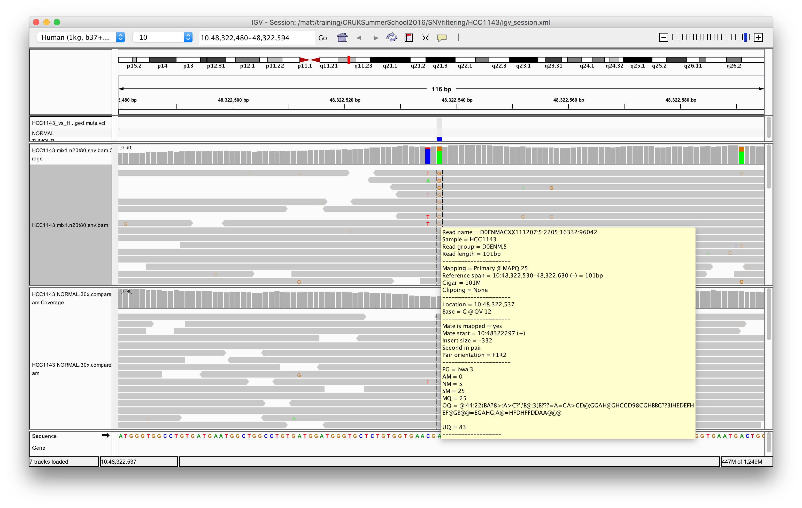
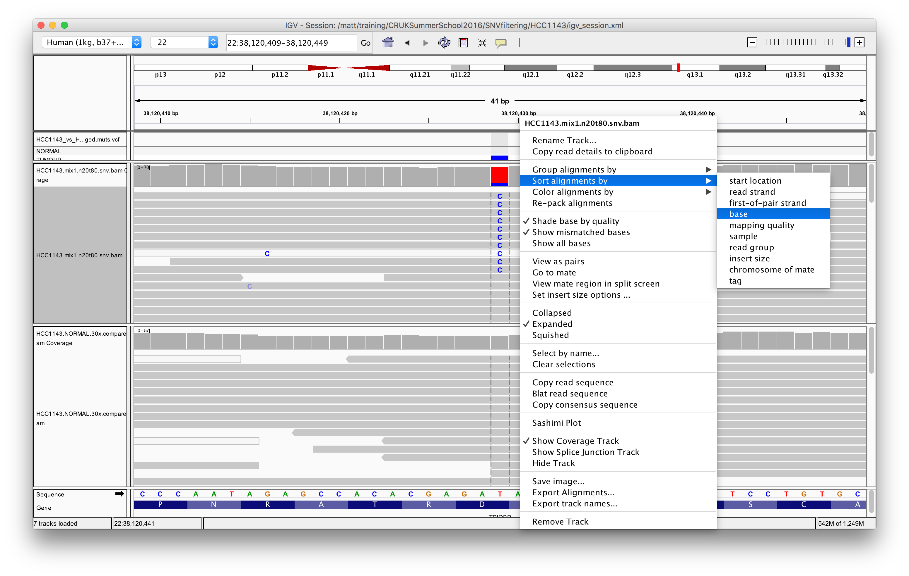
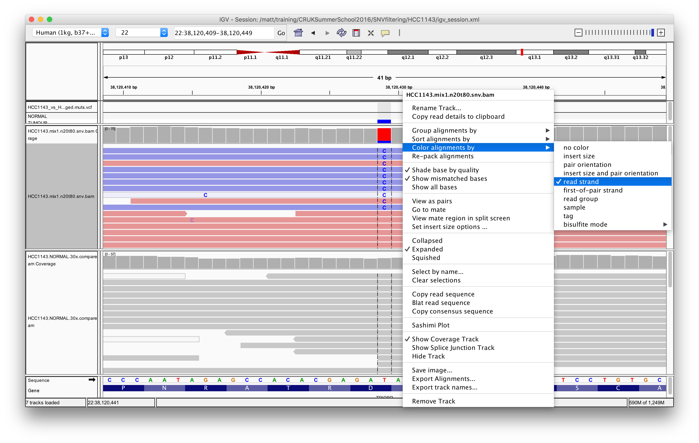
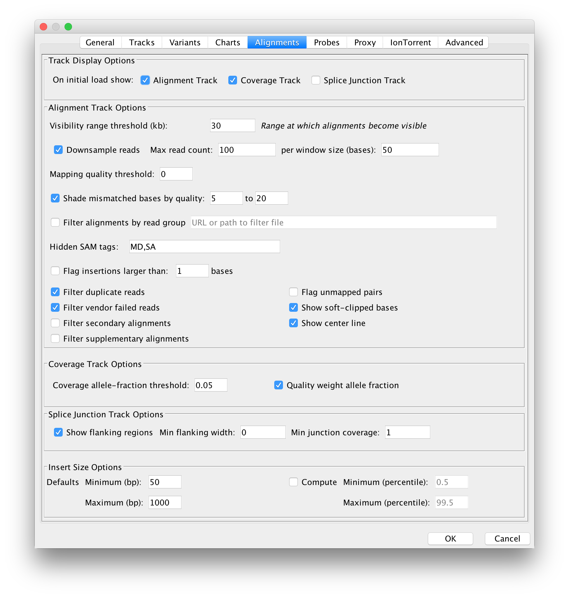
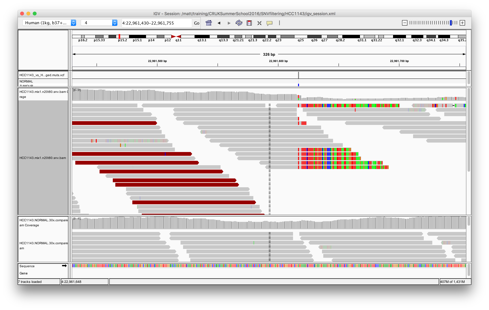

### Introduction

The following tips may be useful for the practical involving visual assessment of a selection of candidate somatic SNVs called by CaVEMan for the HCC1143 breast cancer cell line.

[IGV User Guide](https://www.broadinstitute.org/igv/UserGuide)

### SNVs in the coverage track

Possible variants are highlighted in the coverage track where the allele fraction is above a
configurable threshold. These are the coloured stacked bars within what is a mostly grey
coverage plot, where the coloured portion of each bar represents the fraction of reads with
different alleles at that position.

* Zoom in on one of the coloured bars in the coverage track and hover the cursor over it to show a tooltip that
summarizes the number of reads aligned at the position for each of the different alleles.

### Turn on shading of bases

* Right click in the main panel to get the context menu and ensure that the `Shade mismatched bases` and `Shade bases by quality` options are selected.

Bases in reads that match the reference are coloured grey while bases that do not match are colour coded by base.

Mismatched bases with low base quality are displayed with greater transparency so appear less visible; this has the effect of de-emphasizing low quality variant bases that are more likely to be sequencing errors.

### Zooming and panning

* Zoom in and out using the slider at the top right of IGV or by double-clicking in the main panel.

* Pan left and right by clicking and dragging within the main panel.

Zoom in to focus on the reads covering the variant position.

Zoom out to visualize the broader context and how well the region is mapped. Are there lots of problematic alignments in the wider region in which the variant was called?

### Tooltips for aligned reads

* Hover over a position in a read to get useful information, e.g. base quality and mapping quality scores, about that read.

* Click the tooltip to remove it so you can see the reads underneath (sometimes the tooltips get annoying!).

### Sorting reads

* Right-click over the variant position to bring up the context menu and select `Sort alignments by`, then choose which attribute by which to sort.

It is usually quite helpful to sort by base in the first instance. This brings all the variant reads to the top.

It may also help to sort by mapping quality to see if the variant reads tend to be the most poorly mapped or by strand to see if there is a strand bias.

### Colouring reads

* Right-click to bring up the context menu and select `Colour alignments by` to choose an attribute to use in colouring reads.

Colouring by insert size and pair orientation is very useful for identifying read pairs that align in an unusual manner that may be indicative of a structural rearrangement.

Colouring by read strand can be helpful in detecting strand bias.

Reads with a mapping quality of zero are coloured white with a light grey border. Many aligners assign a mapping quality of zero when the read can be aligned to another position in the genome equally well.

### Viewing clipped alignments

In regions where there are genomic rearrangements, a useful IGV feature is to turn on the display of bases that were clipped from the alignments.

* Select `View -> Preferences...` from the main menu and then click on the `Alignments` tab in the dialog that appears.

* Select the `Show soft-clipped bases` option.

The clipped bases are displayed as if they had not been clipped from the alignment and will be mostly not match the reference sequence. Make sure you have the 'Shade mismatched bases' option turned on as well (see above).

